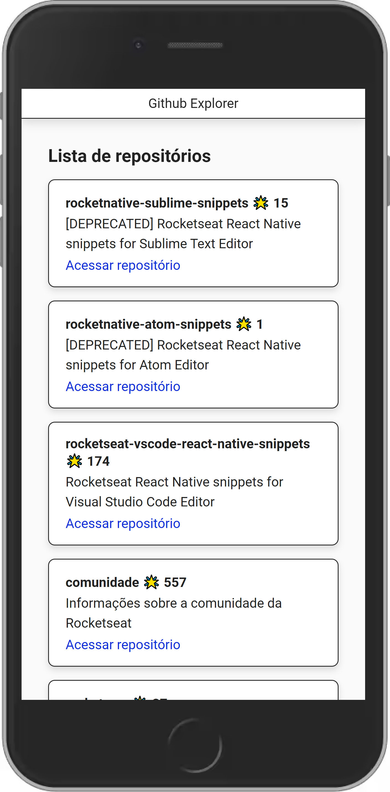

# Github Explorer

## Descrição

Projeto feito para consolidar as bases do ReactJS, Babel, Webpack e conceitos fundamentais como imutabilidade e One-Way Data Binding.

🚀

## Como inicializar

- `git clone https://github.com/EduardoReisUX/github-explorer.git` para clonar este repositório;
- `cd github-explorer`
- `yarn install` para instalar as dependências;
- `yarn dev` para desenvolvimento;
- `yarn build` para produção.

## Espiadinha

